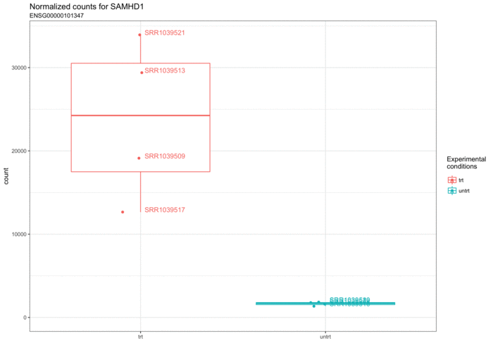
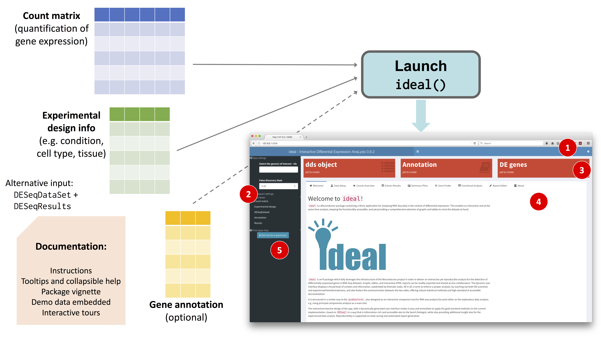
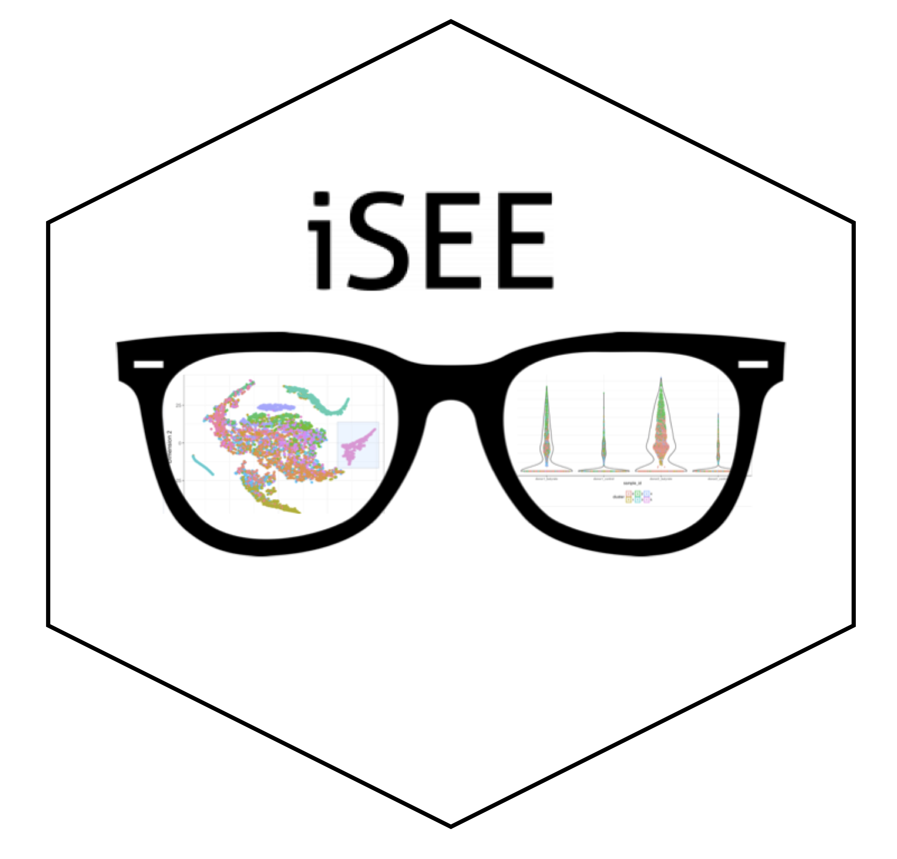

<!-- Next generation sequencing technologies, such as RNA-Seq, generate tens of millions of reads to quantify the expression levels of the features of interest. A wide number and variety of software packages have been developed for accommodating the needs of the researchers, mostly in the R/Bioconductor framework. Many of these focus on the identification of differentially expressed (DE) genes (DESeq2, edgeR, ) to discover quantitative changes between experimental groups, while other address alternative splicing, discovery of novel transcripts, or RNA editing. Moreover, Exploratory Data Analysis is a common step to all these workflows, and despite its importance for generating highly reliable results, it is often neglected, as many of the steps involved might require a considerable proficiency of the user in the programming languages. Principal Components Analysis (PCA) is used often to obtain a dimension-reduced overview of the data. -->

<!-- Our proposal addresses the two steps of Exploratory Data Analysis and Differential Expression analysis with two different Bioconductor packages, pcaExplorer and ideal. We developed web applications in the Shiny framework also including support for reproducible analyses, thanks to an embedded text editor and a template report, to seamlessly generate HTML documents as a result of the user’s exploration. -->

<!-- This solution, which we also outlined in (Marini and Binder 2016), serves as a practical proof of principle of integrating the essential features of interactivity and reproducibility in the same tool, fitting both the needs of life scientists and experienced analyists, thus making our packages good candidates to become companion tools for each RNA-Seq analysis, and also serving as a base for the development of other applications (e.g. for single cell RNA-seq). -->

```{r setup, include=FALSE, cache=FALSE, eval = TRUE, echo = FALSE}
library(knitr)
opts_chunk$set(eval = FALSE, message = FALSE, echo = FALSE, warnings = FALSE)
```

## Hi! {.build}

I'm **Federico Marini**, Virchow Fellow @CTH Mainz/IMBEI 

PhD in Biostatistics/Bioinformatics @IMBEI: </br>**Development of applications for interactive and reproducible data analysis**

<p align="center">
$\rightarrow$ Methods and tools to maximize information extraction and knowledge transfer, strengthen translational interactions 
</p>

</br></br></br> 
    
<div class=blue2>
<p align="center">
You can find this presentation here: [`https://github.com/federicomarini/erum2018`](https://github.com/federicomarini/erum2018)</br> 
`r icon::fa('twitter')` [`@FedeBioinfo`](https://twitter.com/FedeBioinfo)
</div>
</p>

## Background

- large amounts of complex datasets - everywhere!
- lack of analytical skills: data understanding << data generation

Wishlist for accessible and robust data analyses:

- Comprehensiveness
- **Interactivity** (empowers the domain expert $\rightarrow$ better insights)
- **Reproducibility** (re-performing the same analysis with the same code)

Enabling transparency, independent verification, *standing on the shoulder of giants*

Particularly true in the field of Bioinformatics!

## RNA-seq

High-dimensional snapshot of the transcriptomic activity

**RNA-seq**: genes $\times$ samples tables</br>
**Aim**: identification of differentially expressed genes, gene signatures, many more 

<p align="center">

</p>

```{r echo=FALSE,eval=FALSE}
library(ggplot2)
library(airway)
library(DESeq2)
library(cowplot)
data(airway)
dds_airway <- DESeq2::DESeqDataSet(airway,design = ~cell + dex)
dds_airway <- estimateSizeFactors(dds_airway)
dds_airway <- DESeq(dds_airway)
res_airway <- results(dds_airway)
res_airway <- lfcShrink(dds_airway,coef = "dex_untrt_vs_trt",type = "apeglm")
tbl_res_airway <- FMmisc::deseqresult2tbl(res_airway)
library(org.Hs.eg.db)
tbl_res_airway$symbol <- AnnotationDbi::mapIds(org.Hs.eg.db,keys = tbl_res_airway$id,column = "SYMBOL","ENSEMBL")
library(ideal)
# some examples: 
ggplotCounts(dds_airway,intgroup = "dex",gene = "ENSG00000162692",transform = F) + ylim(0,NA) # VCAM1
ggplotCounts(dds_airway,intgroup = "dex",gene = "ENSG00000157214",transform = F) + ylim(0,NA) # STEAP2
ggplotCounts(dds_airway,intgroup = "dex",gene = "ENSG00000198561",transform = F) + ylim(0,NA) # CTNND1
ggplotCounts(dds_airway,intgroup = "dex",gene = "ENSG00000162643",transform = F) + ylim(0,NA) # WDR63
ggplotCounts(dds_airway,intgroup = "dex",gene = "ENSG00000103196",transform = F) + ylim(0,NA) # CRISPLD2
```

```{r eval=FALSE,echo=FALSE}
# pick 50 from the top 1k?
frames <- 50
 
# function for creating file name with leading zeros
# makes it easier to process them sequentially
rename <- function(x){
  if (x < 10) {
    return(name <- paste('000',i,'plot.png',sep=''))
  }
  if (x < 100 && i >= 10) {
    return(name <- paste('00',i,'plot.png', sep=''))
  }
  if (x >= 100) {
    return(name <- paste('0', i,'plot.png', sep=''))
  }
}

set.seed(42)
frames_to_pick <- sample(1:1000,50)
 
# loop through plots
for(i in frames_to_pick){
  name <- rename(i)
  # will read in tbl_res_airway
  thisgene <- tbl_res_airway$id[i]
  thisgene_sym <- tbl_res_airway$symbol[i]
  p <- ideal::ggplotCounts(dds_airway,intgroup = "dex",gene = thisgene,transform = F) + 
    ylim(0,NA) + 
    ggtitle(paste0("Normalized counts for ", thisgene_sym),
            subtitle = thisgene)
   ggsave(p,filename = file.path("anim_counts",name))
}

#run ImageMagick
# 3 fps
my_command <- 'convert -delay 1x3 -resize 700x500 anim_counts/*.png animation_1x3_resized.gif'
# 3 fps with initial delay
my_command2 <- 'convert -delay 2000 anim_counts/0004plot.png -delay 1x3 anim_counts/*.png -resize 700x500 animation_1x3_resized_20secstart.gif'

system(my_command)
system(my_command2)
```

## Platelets transcriptomics {.build}

Exploratory Data Analysis (EDA) + Differential Expression (DE) analysis $\rightarrow$ **analyze, visualize, integrate**

- thrombocytes: anucleated, yet carrying a vast repertoire of transcripts
- scenarios: alteration of thrombin signaling, crosstalk with tumor development 

`r emo::ji("pray")` The Bioconductor project makes these task possible for many researchers!    

My contributions: 

- `pcaExplorer` (Bioc 3.3) - Interactive Visualization of RNA-seq Data Using a Principal Components Approach, [`http://bioconductor.org/packages/pcaExplorer/`](http://bioconductor.org/packages/pcaExplorer) <!-- sample forensics & data-exploration-driven decisions -->
- `ideal` (Bioc 3.5) - Interactive Differential Expression AnaLysis, [`http://bioconductor.org/packages/ideal/`](http://bioconductor.org/packages/ideal/)

<p align="center">
$\rightarrow$ **Web-based applications** enabling interactivity and reproducibility
</p>

## Under the hood {.build}

<p align="center">

</p>

<!-- no slide, but talk about these points here: -->
<!-- > - embedded text editor: exploiting `shinyAce` -->
<!-- > - no white sheet syndrome: provide **template report**, editable if needed - plus, include a preview in the app -->
<!-- > - reporting: Rmarkdown + `reactiveValues` accessed when knitting and rendering -->
<!-- > - saving & sharing: binary objects to workspace/global environment (overhaul to Shiny support for bookmarking?)  -->
<!-- > - interactive tours based on `introJS` library -->
<!-- allow us to... -->
<!-- > - have many of the common steps in analysis covered by GUIs to empower the user -->
<!-- > - still, use the gold standard protocols on the back-end -->
<!-- > - get for free a full report of the app after live exploration -->

## `pcaExplorer` and `ideal`

### Motivation & aim

> - general downweighting of the importance of data exploration (essential step!)
> - lack of something to do this interactively (and fully integrated in Bioconductor)
> - transparency & help for future self was also needed  $\rightarrow$ automated reporting & state saving!
> - empower the domain expert (extensively used by our coop partners): not just list, but all the way down to functional interpretation
> - usable platform for reproducible analysis, interactive tours for self-paced learning (via `rintrojs`)

## Workflow overview & quick demo {.build .smaller}

<p align="center">

</p>

`scfull_pcaexplorer_ideal.mov`, also at [`https://www.youtube.com/watch?v=EckimPqRcCg`](https://www.youtube.com/watch?v=EckimPqRcCg)

## `iSEE`ing is believing {.build}

Single cell RNA-seq, a.k.a. *Data exploration has probably never been so important* 
<!-- - hidden gems (hypotheses, findings) come out only via extensive (and proper) exploration.  -->

**scRNA-seq**: genes $\times$ cells </br>
**Aim**: Identification of cell subpopulations, description of developmental trajectories

- time consuming task + many iterations needed
- *how did I do this plot?*

`iSEE`, interactive SummarizedExperiment Explorer: concept made in December 2017 @Bioc conference (joint work with Aaron Lun, Charlotte Soneson, Kevin Rue-Albrecht)

**Wishlist**: interactivity, linked information across plots, reproducibility, hammer for many nails

<!-- iSEE provides a general interactive interface for visual exploration of high-throughput biological data sets. -->
<!-- Any study that can be represented in a SummarizedExperiment object can be used as input, allowing iSEE to accommodate a diverse range of `-omics data sets. -->
<!-- The interface is flexible and can be dynamically customized by the user; supports exploration of interactions between data aspects through colouring and linking between panels; -->
<!-- and provides transparency and reproducibility during the interactive analysis, through code tracking and state reporting.  -->
<!-- The most obvious use of iSEE is that of data exploration for hypothesis generation during the course of a research project. -->
<!-- However, we also anticipate that public instances of iSEE will accompany publications to enable authors to showcase salient aspects of their work using guided tours. -->

## A few months (and about 1000 commits) later... {.build}

<p align="center">
 
</p>

... developed on GitHub at [`https://github.com/csoneson/iSEE`](https://github.com/csoneson/iSEE)

## Ready for a demo?

```{r eval=FALSE, echo =TRUE}
# now in Bioc 3.7!
source("https://bioconductor.org/biocLite.R")
biocLite("iSEE")
library("scRNAseq")
data("allen")
library("scater")
sce <- as(allen, "SingleCellExperiment")
counts(sce) <- assay(sce, "tophat_counts")
sce <- normalize(sce)
sce <- runPCA(sce)
sce <- runTSNE(sce)
library("iSEE")
iSEE(sce)
# couple of genes to check: (Zeisel, Science 2015; Tasic, Nature Neuroscience 2016)
# Tbr1 (TF required for the final differentiation of cortical projection neurons);
# Snap25 (pan-neuronal); 
# Rorb (mostly L4 and L5a); 
# Foxp2 (L6)
```

Or just visit [`http://shiny.imbei.uni-mainz.de:3838/iSEE_PBMC4k`](http://shiny.imbei.uni-mainz.de:3838/iSEE_PBMC4k)

## Outlook {.build}

Flexibility + Customizability $\rightarrow$ Accompanying publications as live browser!

<p align="center">

</p>

## Summary {.build} 

> - **Main aim**: Making analyses and exploration accessible to a wide range of scientists, especially domain experts, while still upholding the high standards in guaranteeing reproducible research steps

> - **real practical companions for any (RNA-seq/omics) dataset**, fully integrated in Bioconductor

<!-- > - Usable software: easy to use, easy to learn (Poplawski et al, BiB 2016) -->

> - `r emo::ji("heart")` bug reports and `r emo::ji("heart")``r emo::ji("heart")``r emo::ji("heart")` pull requests!

> - Fellowship output focus on Thrombosis & Hemostasis, enabling analysis workflows of high-dimensional data: *platelet-o-pedia* portal as unique landing point, lower barriers to genomic data exploration - these apps as cornerstones

<!-- > - Resource/platform applicable on wider scale of scenarios  -->

<!-- (e.g. similar cell types) -->
<!-- > - Bioinformatics (with interactivity & reproducibility) as nodal point in the translational pipeline (key message from my PhD thesis) -->
> - Proper applications & software enable data literacy for many researchers - naturally encouraging networking possibilities + common ground to promote openness of science

## Acknowledgements & Links

- Center for Thrombosis and Hemostasis (CTH), Mainz (Virchow Fellowship)  
- IMBEI - Bioinformatics division
- Charlotte Soneson, Aaron Lun, Kevin Rue-Albrecht (the `iSEE` team)

**Try out the packages**:

- **[`http://bioconductor.org/packages/iSEE/`](http://bioconductor.org/packages/iSEE/)** (or try it out on our server)
- [`http://bioconductor.org/packages/pcaExplorer/`](http://bioconductor.org/packages/pcaExplorer/)
- [`http://bioconductor.org/packages/ideal/`](http://bioconductor.org/packages/ideal/)
- Shiny Server @IMBEI: </br>[`http://shiny.imbei.uni-mainz.de:3838/[pcaExplorer|ideal|iSEE]`](http://shiny.imbei.uni-mainz.de:3838/iSEE) 

<div class=red2>
<p align="center">
<font size="6">
**Thank you for your attention!**</font></br></br>
<code>marinif@uni-mainz.de</code> - `r icon::fa('twitter')` [`@FedeBioinfo`](https://twitter.com/FedeBioinfo)
</p>
</div>


